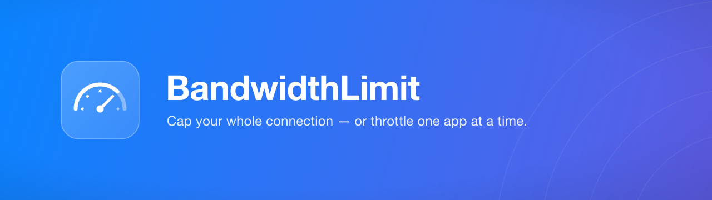
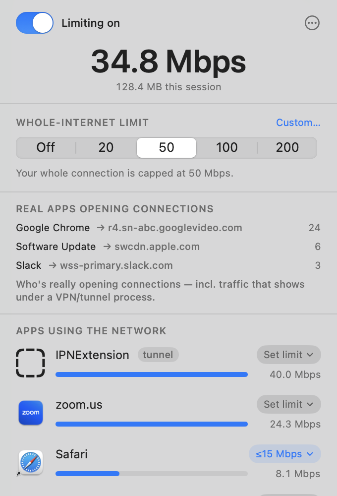

<p align="center">
  
</p>

<p align="center">
  Keep one app — or one burst — from eating your whole internet connection.
</p>

<p align="center">
  
  
  
  
</p>

---

**BandwidthLimit** is a macOS menu-bar app that caps your total internet speed so a backup,
update, or big download can't saturate your connection — and throttles individual apps to their
own per-app limit. It shows live per-app throughput, reveals which real apps are behind
VPN/tunnel traffic, and stays out of your way in the menu bar.

<p align="center">
  
</p>

## Features

- **Whole-internet cap** — one segmented control (`Off / 20 / 50 / 100 / 200 Mbps`, or a custom
  value) limits your entire connection so no single burst takes it all.
- **Per-app throttle** — cap a specific app (e.g. Safari ≤ 15 Mbps). Limits follow the app across
  all of its helper processes.
- **Live per-app monitor** — see who's using the network right now, in Mbps, with a running
  session total.
- **Reveals traffic behind VPNs** — a transparent-proxy system extension attributes flows to the
  *real* originating app, so traffic a VPN/tunnel would otherwise hide gets named.
- **Honest totals** — tunnel/VPN processes are tagged and excluded from the total so their
  re-emitted bytes aren't double-counted.
- **Filter & hide** — show only limitable apps, or hide processes you don't care about.
- Menu-bar only (no Dock icon), launch-at-login, light/dark aware.

## How it works

| Capability | Mechanism |
|---|---|
| Whole-internet cap | `pfctl` + `dnctl` dummynet pipe, run by a root **privileged helper** (`SMAppService` daemon over XPC) |
| Live per-app monitor | shells out to `nettop`, diffs two cumulative samples → per-process Mbps |
| Per-app throttle | a **`NETransparentProxyProvider`** system extension proxies a limited app's flows through a per-app token bucket; unlimited apps are declined (zero overhead) |
| App attribution | each flow's originating PID → its parent `.app` bundle id, matched on both the monitor and the proxy |

macOS has no way to rate-limit by app in `pf`/`dummynet` (it only matches IP/port/interface), so
per-app throttling requires the system extension — a content filter can only allow/block, not
throttle.

## Build

Requires Xcode 15+ and [XcodeGen](https://github.com/yonaskolb/XcodeGen) (the `.xcodeproj` is
generated from `project.yml`, which is the source of truth).

```sh
brew install xcodegen
./build.sh
```

## Install & run

```sh
./install.sh
```

This enables system-extension developer mode, copies the app to `/Applications`, and launches it.
Then, in the menu-bar popover:

1. Pick a **whole-internet limit**, or a per-app **Set limit** — enforcement turns on automatically.
2. The first time enforcement starts, approve **BandwidthLimit Proxy** in
   *System Settings ▸ General ▸ Login Items & Extensions*.

Verify end to end with `./verify.sh`.

> **Note:** this is an unsigned, local-dev build (ad-hoc signed under
> `systemextensionsctl developer on`). Distributing it would need a paid Apple Developer account
> for the `networkextension` entitlement + notarization.

## Architecture

```
App/           menu-bar app — AppDelegate (status item + popover), PopoverView/Model (SwiftUI),
               Monitor (nettop), GlobalCap (XPC client), ProxyControl (system extension + proxy)
Helper/        root daemon — XPC service running pfctl/dnctl + its launchd plist
PacketTunnel/  the system extension — Provider (flow pumps + attribution) + TokenBucket
Shared/        Config (App Group defaults), AppIdentity (PID → app), HelperProtocol (XPC contract)
```

## Known limitations

- **Local-dev only** — not notarized or distributable without a paid Apple Developer account.
- **Per-app throttle needs the system extension approved** — the whole-internet cap and the live
  monitor work without it.
- Byte-level attribution is exact only for flows the proxy actively throttles; for others it
  reports the app and destination, not throughput.

## License

[MIT](LICENSE) © Adam Benhassen
